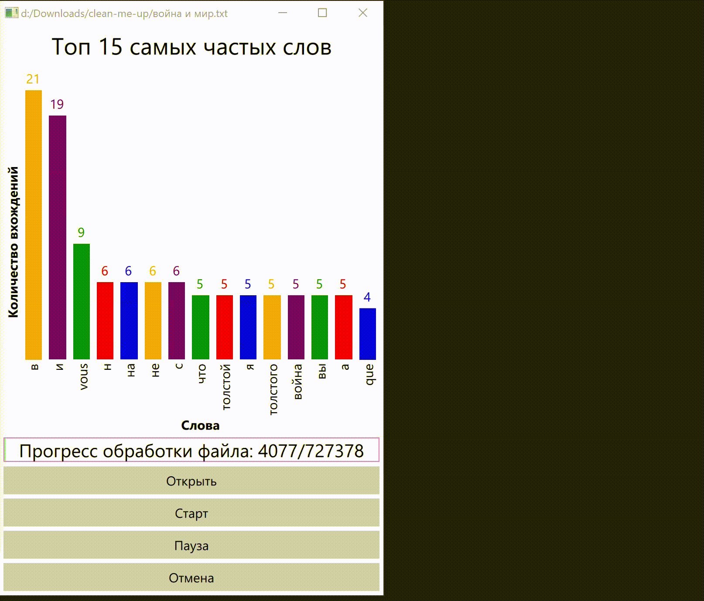

A small demo application that shows the top 15 most frequent words from a text file in real time as a bar chart. The file is read and processed in a separate thread from the GUI.

The GUI is implemented using QML. 
\*.qml files in the project:
* **RotationFixer** - a simple **Item** that fixes the problem of incorrect sizes after applying rotation to an object (in particular, to a **Label**) by an arbitrary angle. For example, after rotating a **Label** by 90 degrees, the height and width of the object remain original instead of being swapped. This behavior interferes with the correct arrangement of objects inside the **Layout**. Simply creating a rotated object inside the **RotationFixer** helps to solve the problem.
* **OrientedGridLayout** - a specialized **GridLayout** for quickly transposing the organization table of elements. A table with one column or row is the equivalent to a switch between **RowLayout** and **ColumnLayout**. It is required to reorient the interface of the main window and elements inside the bar chart.
* **BarChart** - a composite element representing a bar chart (histogram). The bar chart can be switched between horizontal and vertical reflection. The orientation of the bar chart is set by the *verticalBars* property. The properties provide access to the axis labels and histogram names as well as the background and colors of bars. Bar color can be set in another way - by overriding the *getBarColor* generator function. All internal elements are placed using *Layout*. Individual bars and labels are created using **Repeater**. The values for plotting the histogram are passed to *Repeater.model* as a list of *{name(string) value(number)}* objects. The bar size is determined by the value relative to the maximum value in the entire list. *TODO*: move the bar component to the **BarChart**'s property for customization.
* **MainWindow** obviously is the main and single window. The window has a set of four buttons: "Open", "Start", "Pause", "Cancel". The position of the buttons is determined by the largest window resolution (height or width): at the bottom or on the side of the window. The window also contains a histogram which is also oriented along the largest direction. The "Open" button calls a file open dialog and the dialog then passes the selected path to the C++ layer via the **WordsCounter** object. The other buttons also interact with this object. There is a progress bar to display the progress of file processing. It is consists of a simple filling line and a label with a numerical display of progress. The progress bar is directly connected to the *progressCurrent* property of the **WordsCounter** object. In opposite the bar char is updated by a **Timer** with small time interval to not overload the event handler.

On the C++ side: 
* Classic generated *main()* with Q-Application instance and QML engine. Only **QWordsCounter** registration for QML has been added.
* QWordCount is a minor class-structure with *Q_GADGET* inside. It is a pair of *{word, number of occurrences}*. The list of such objects is sent to the QML side to create bar plot.
* **QWordsCounter** is an extension of **QObject**, it is a bridge between QML and C++ and also implements the most application logic. It would be right to create another bridge dividing the object into two parts: leaving only the interface with *Q_PROPERTY* and *Q_INVOKABLE* and separately computing and multithreaded implementation. But the class is very compact and the project is demonstrative so it is convenient when all the code is in one place. Here are the externally accessible properties of **QWordsCounter**: 
	* *fileName* - path to a regular open file. When this property is set, the current file processing is interrupted (safely), and a file at the new specified path is opened instead.
	* *progressTotal* - measure the file size, i.e. the number of bytes that need to be run to completely process the file and count all the words. Updated immediately after opening the file.
	* *progressCurrent* - the current position of the file stream (actually text stream) iterator. Updated with each word read.
	* *tartFileProcessing()* - starts file processing in a separate thread. Before starting a new processing thread, the old one is softly interrupted (*cancelFileProcessing()* called). A new processing thread is created. Qt-provided synchronization primitives are used. Also to process the file in parallel with obtaining the top of most frequent words the lambda function that captured the *this* is passed to the convenient function *QtConcurrent::run()*. **QFuture<void>** is returned to be able to get the state of the file processing. The functionality of **QThread** with its signals is redundant here. In the new thread, an abstraction from the file is created - a **QTextStream**. Words are extracted from it first using the built-in operator for reading words separated by whitespaces and then using a regular expression. The word occurrence counters are placed in **std::map\<QString, quint64>**. The resource is protected using **QWriteLocker**. To be able to interrupt processing in each iteration cycle (~each word), an atomic flag appears (there is no flag in Qt, but there is an atomic bool).
	* *pauseFileProcessing()* pauses file processing by securing the resource when creating a **QReadLocker** placing it in the **QScopedPointer** class member.
	* *resumeFileProcessing()* resumes processing by destruction of the specified **QReadLocker**.
	* *cancelFileProcessing()* correctly interrupts processing first releasing it from the pause then calling the mentioned atomic flag and waiting for finish of the file processing thread. Resets the word counters and the file stream iterator. 
	* *getFrequentWords(count)* extracts top of the *#count* most frequent words. Partial sorting is perfect for this. The algorithm of partial sorting is included in the STL. STL containers are well-matched with STL algorithms  which is why **std::map** is used for the counter, not **QMap**. Synchronization with the processing thread is provided by *pauseFileProcessing()*. The top of *#count* words are simply copied to **QList\<QWordCount>**.

	The *{start/pause/resume/cancel}FileProcessing* method group could be equivalently replaced with a property of the **enum FileProcessingState type {NotRunning, Running, Paused}** and all the actions may be handled in the set-method.

Demonstration:
* Start/Stop/Cancel

* Resizing window

